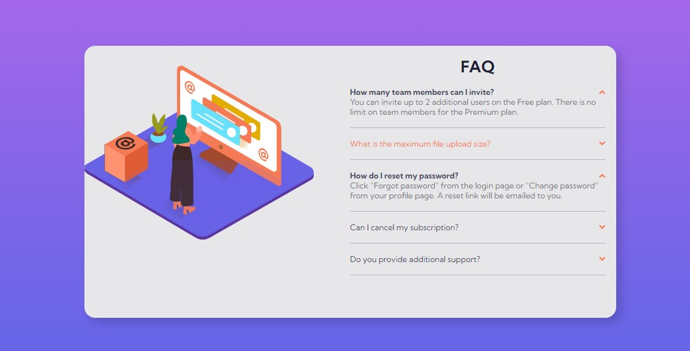
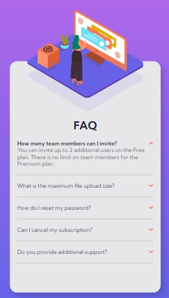

# Frontend Mentor - FAQ accordion card solution

This is a solution to the [FAQ accordion card challenge on Frontend Mentor](https://www.frontendmentor.io/challenges/faq-accordion-card-XlyjD0Oam). Frontend Mentor challenges help you improve your coding skills by building realistic projects. 

## Table of contents

- [Overview](#overview)
  - [The challenge](#the-challenge)
  - [Screenshot](#screenshot)
  - [Links](#links)
- [My process](#my-process)
  - [Built with](#built-with)
  - [What I learned](#what-i-learned)
- [Author](#author)

## Overview

### The challenge

Users should be able to:

- View the optimal layout for the component depending on their device's screen size
- See hover states for all interactive elements on the page
- Hide/Show the answer to a question when the question is clicked

### Screenshot

### Links

- Solution URL: [GitHub](https://github.com/BryanCarlos/FAQ-Accordion-Card)
- Live Site URL: [GitHub Page](https://your-live-site-url.com)

## My process

### Built with

- Semantic HTML5 markup
- CSS custom properties
- Flexbox
- Javascript
- Mobile-first workflow

### What I learned

For this project, I tried to use a few CSS animations that works well, but not perfectly yet. 
Those animations I'll try to use in other projects.

## Author

- GitHub - [@BryanCarlos](https://github.com/BryanCarlos)
- Frontend Mentor - [@BryanCarlos](https://www.frontendmentor.io/profile/BryanCarlos)
- LinkedIn - [@bryan-carlos-silva](https://www.linkedin.com/in/bryan-carlos-silva/)